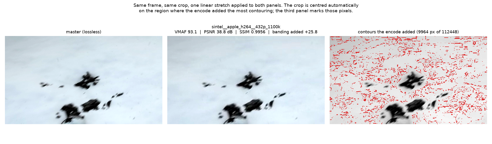
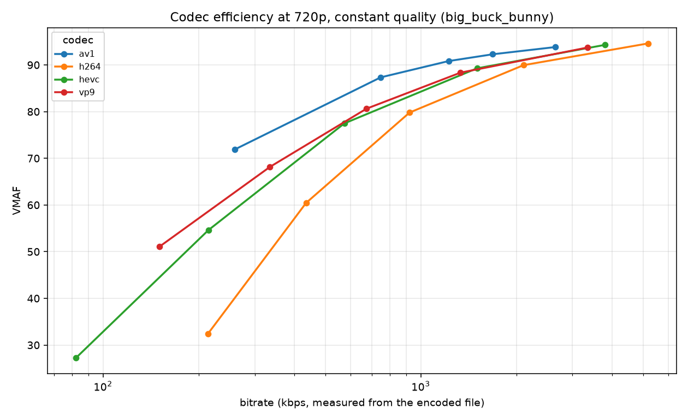
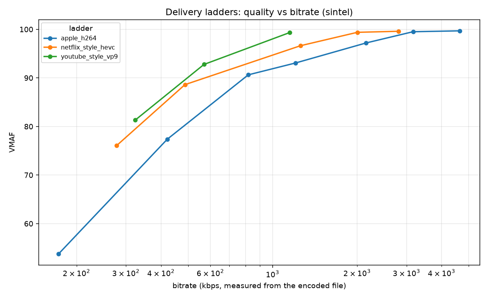
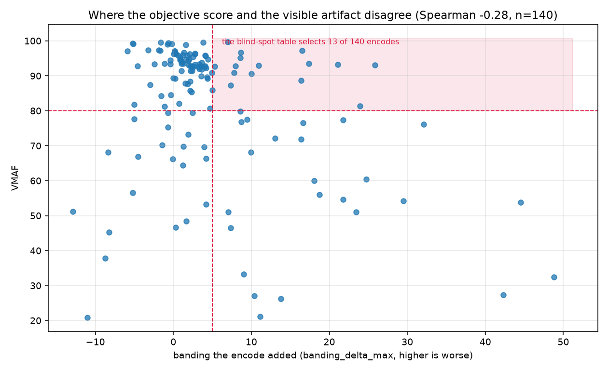
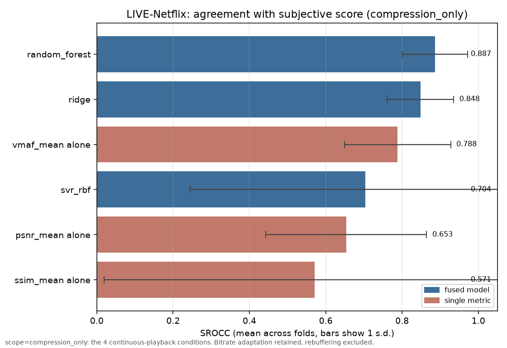

# PixelJudge

[](https://github.com/Dhruvdubey17/pixeljudge/actions/workflows/ci.yml)


A full-reference video quality analysis engine. It encodes open master clips
through real streaming ladders, measures PSNR, SSIM, MS-SSIM and VMAF in a single
libvmaf pass, compares codec efficiency with BD-Rate, fits a regressor from those
metrics to human opinion scores, and then shows where the metrics disagree with what
you can plainly see.

The question it answers: **why does the same film look different across streaming
platforms?** Short version: platforms differ in codec choice and encoding-ladder
design. This project measures how much that costs, in bits and in quality.

---

## Results

140 encodes across 4 master clips and 7 ladders (3 delivery ladders + 4 constant-quality
codec sweeps), each measured against its lossless master in a single libvmaf pass, then
scanned for artifacts. Every figure and table below regenerates with
`uv run pixeljudge report`.

### 1. The metrics can call an encode excellent while the encoder visibly damaged it



The same frame of Sintel: lossless master on the left, the Apple HLS ladder's 432p /
1100 kbps rung in the middle, and on the right the pixels our detector says the *encode
added*. The snowfield has broken into mottled patches that are not in the master.

What the metrics say about that middle panel:

| VMAF | PSNR-Y | SSIM | banding added |
| --- | --- | --- | --- |
| **93.08** | **38.82 dB** | **0.9956** | **+25.8** |

All three read as "good encode". VMAF 93 is above most delivery targets, PSNR near 39 dB
is conventionally high quality, and SSIM 0.9956 is almost indistinguishable from 1. None
of them is designed to see contouring in a smooth region, which is why Netflix built a
separate index (CAMBI) for it.

13 of the 140 rungs land in that quadrant — VMAF ≥ 80, PSNR ≥ 38 dB, **and** more than 5
points of *added* banding. Full list in [`reports/blind_spots.csv`](reports/blind_spots.csv);
the strongest few:

| clip | bitrate | VMAF | PSNR-Y | banding added |
| --- | --- | --- | --- | --- |
| sintel, H.264 432p | 1208 kbps | 93.08 | 38.82 dB | +25.8 |
| gradient, H.264 CRF 44 | 60 kbps | 93.26 | 44.59 dB | +21.1 |
| gradient, AV1 CRF 63 | 10 kbps | 93.47 | **47.24 dB** | +17.4 |
| sintel, H.264 540p | 2154 kbps | 97.20 | 40.75 dB | +16.5 |

The third row is the sharpest version of the point: **PSNR 47 dB** — a number usually
read as "visually lossless" — on a clip where the encoder measurably added contours.

> **The control that nearly wasn't run.** The first version of this table had 25 entries,
> all Sintel, topped by a rung at VMAF 99.7. It was wrong. Scanning the *masters* shows
> Sintel's lossless master already scores 52.4 for banding — it is stylised animation with
> graded skies, and those contours are the art direction. An absolute no-reference score
> was measuring the content, and VMAF 99.7 was **correct**. Master banding by clip: Sintel
> 52.4, Jellyfish 26.7, Big Buck Bunny 3.2, synthetic gradient 2.7. Every number above is
> now a *delta* against the master, which is the only form the claim can honestly take.

### 2. Codec efficiency: BD-Rate against H.264



Constant-quality sweeps at 720p, five CRF points per codec, BD-Rate computed in
log-bitrate with PCHIP interpolation over the overlapping quality range. Negative means
the challenger needs fewer bits for the same VMAF.

Averaged over the three photographic clips:

| codec | BD-Rate vs H.264 | BD-quality | per-clip range |
| --- | --- | --- | --- |
| **AV1** (SVT-AV1, preset 8) | **−53.7%** | +13.4 VMAF | −47.0% … −58.4% |
| **VP9** (libvpx) | **−42.5%** | +10.7 VMAF | −38.0% … −51.7% |
| **HEVC** (x265, medium) | **−40.2%** | +9.6 VMAF | −36.3% … −46.5% |

These sit squarely on the published expectations (HEVC ≈ 40–50% over H.264, AV1 ≈ 50–60%),
which is the most reassuring thing about them. Note the per-clip range: one clip's BD-Rate
differs from another's by more than ten percentage points, so a single headline number
oversells the precision. Per-source rows are in
[`reports/bd_rate.csv`](reports/bd_rate.csv), and the synthetic gradient clip is excluded
from the mean above — it is nearly flat content where every codec hits its rate floor, and
it flatters VP9 and AV1 (−72.7% and −66.0%).

### 3. Delivery ladders: what each recipe costs for the same quality



Bitrate each ladder needs to reach VMAF 90 on the same master:

| master | Apple HLS (H.264) | HEVC ladder | VP9 ladder |
| --- | --- | --- | --- |
| big_buck_bunny | 2778 kbps | 2367 kbps | **2080 kbps** |
| jellyfish | 2947 kbps | 2468 kbps | never reaches 90 |
| sintel | 819 kbps | 1258 kbps | **569 kbps** |
| gradient (synthetic) | 126 kbps | **89 kbps** | 295 kbps |

Two things worth reading carefully, because they are ladder effects rather than codec
effects:

* **The VP9 ladder never reaches VMAF 90 on Jellyfish** (it tops out at 84.2). Its highest
  rung is 720p at 1500 kbps, and that clip's motion and detail need more. The same ladder
  wins on Big Buck Bunny. A ladder is a bet about content, and this is what losing it
  looks like.
* **The HEVC ladder is *worse* than H.264 on Sintel** (1258 vs 819 kbps) despite HEVC being
  the more efficient codec — its rungs are simply spaced differently, and the next one up
  overshoots. Codec efficiency and ladder design are separate questions, which is why this
  table and the BD-Rate table are computed from different encodes.

That is the answer to "why does the same film look different across platforms", in
measurements: the codec accounts for tens of percent, and the ladder can hand it back.

### 4. Where the objective score and the artifact disagree



Each point is one of the 140 encodes: VMAF against the banding it added relative to its
master. The shaded quadrant is the blind-spot rule.

The relationship is **Spearman −0.28**. That is the honest summary, and it is more
interesting than "VMAF is blind to banding": the correlation is negative, so VMAF does pick
up *something*, but weakly enough that plenty of encodes sit high on the quality axis and
far to the right on the damage axis. Note also the points at negative delta — compression
sometimes *reduces* measured contouring, by smoothing content that already had it. That is
most of what Jellyfish does (mean delta −3.3), and it is why an absolute banding score
cannot answer this question at all.

### 5. Do these metrics actually predict what people think?

Run on the **LIVE-Netflix Video QoE Database** (VideoATLAS release), which ships
pre-computed per-frame quality vectors *and* the subjective scores, so it needs no media
access grant.

**Scope: compression-only.** This matters more than any other choice on this page.
LIVE-Netflix is a *Quality of Experience* database — half its eight playout patterns
contain rebuffering, and the human score reflects the stalls as much as the compression.
PSNR/SSIM/MS-SSIM/VMAF measure compression distortion and cannot observe a stall at all.
The dataset makes that boundary literal: for the 56 stalled videos, the playout frame
count exceeds the quality-vector length by exactly `stall_seconds × fps`, because the
vectors are computed on the stall-removed video. So the table below uses only the **four
continuous-playback conditions — 56 clips over all 14 contents.** Bitrate adaptation is
kept (the metrics see it fine, as a dip in per-frame quality); only rebuffering is
excluded. Numbers from the all-conditions scope would describe QoE, not compression
quality, and are not presented here as if they were.

Features are each metric pooled two ways (arithmetic mean and libvmaf's harmonic mean).
Evaluation is nested, content-grouped 5-fold CV; every single-metric baseline gets its own
VQEG 5-parameter logistic fitted per fold, which is the *friendlier* deal — the fused
model's predictions are used as-is.

| predictor | PLCC | SROCC | KROCC | RMSE |
|---|---|---|---|---|
| **RandomForest (fused)** | **0.8766** | **0.8353** | **0.6589** | **0.4146** |
| SVR-RBF (fused) | 0.7793 | 0.8253 | 0.6545 | 0.5517 |
| Ridge (fused) | 0.6979 | 0.7883 | 0.6169 | 0.6483 |
| VMAF alone | 0.7479 | 0.6876 | 0.5052 | 0.5659 |
| SSIM alone | 0.5117 | 0.5314 | 0.4182 | 0.8162 |
| PSNR alone | 0.4917 | 0.5094 | 0.3753 | 0.7754 |

*LIVE-Netflix, compression-only scope (56 clips / 14 contents), content-grouped 5-fold CV.
Labels are the database's `final_subj_score`, which is Z-scored per session and per
subject — so RMSE is in Z-score units, comparable within this table only, not a 1–5 MOS.*



**Two results, and the second qualifies the first.**

VMAF is comfortably the strongest single metric (SROCC 0.688 vs SSIM 0.531 and PSNR
0.509), and fusing the four beats it (0.835 vs 0.688). But per fold, RandomForest averages
SROCC **0.887 ± 0.086** against VMAF-alone's **0.788 ± 0.139** — a margin of 0.099 that is
*smaller than VMAF's own fold-to-fold spread*. With 14 contents a fold is 2–3 contents, and
one unusual content moves the number a long way. The honest claim is "fusion is ahead of
VMAF by about one fold's worth of noise, consistently across folds", not "fusion beats
VMAF". SVR makes the point loudly: mean SROCC 0.704 with a standard deviation of 0.460,
i.e. one fold went badly wrong and the mean alone would hide it.

**The ranking survives a change of protocol.** Re-run against the release's own
pre-generated 80/20 content splits (`split_mode: released_splits`, 25 trials), which is
how the published LIVE-Netflix results were produced, and the order is unchanged:
RandomForest 0.808, SVR 0.784, Ridge 0.747, VMAF-alone 0.726, SSIM 0.637, PSNR 0.460
(mean SROCC across trials). Two different splitting protocols agreeing on the ordering is
worth more than either number on its own.

**Why fusion helps is specific, not vague.** Chasing the fold where SSIM-alone hit PLCC
−0.355 found the reason: `content_10`'s *worst* condition scores SSIM 0.922 while
`content_05`'s *best* scores 0.878 — yet the first was rated far lower. SSIM ranks
conditions correctly *within* a content but its absolute value is not comparable *across*
contents, because it depends on how much detail the source has. VMAF ranks the same pair
correctly (22.5 vs 4.7); being content-independent is exactly what it was trained for. The
fused model helps because it can learn a content-independent combination, and that is also
why harmonic-mean VMAF carries the largest random-forest importance (0.274) while both
PSNR features sit near 0.01.

**Independent validation — partly done, partly blocked.** Re-deriving these features with
PixelJudge's own `measure` pipeline needs the LIVE-Netflix source videos, which are
distributed by request form and emailed password (and 11 of the 14 contents are proprietary
Netflix material). That is not done. The half that *could* be run without the media was:
each `.mat` carries both the per-frame vector and the pooled scalar its authors computed
from it, and our pooling reproduces their `VMAF_mean`/`PSNR_mean` to a worst-case
**1.42e-13** across all 112 videos — which rules out pooling as a source of disagreement
and leaves only the measurement half unverified. `pixeljudge mos validate --ours <csv>` and
its tests are in place, so the full check is one command once the media arrives.

**NFLX-P remains pending as a future third confirmation.** Its label file is parsed and in
hand (70 clips, 9 contents; its panel DMOS agrees with the dataset's separate expert scores
at SROCC 0.949), but its videos are behind the same kind of access request.

---

## The honest framing (read this before the numbers)

**These are not measurements of Netflix, Prime or YouTube.** Two independent reasons,
and the first is the one that matters technically:

1. **No reference exists for you.** Full-reference metrics need the pristine studio
   master. The platform has it; you do not. Without it there is nothing to compare
   against, so the method does not apply at all.
2. **DRM, and the law.** Delivered streams are encrypted (Widevine, PlayReady,
   FairPlay), HDCP blocks screen capture and yields black frames, and circumventing
   that would violate the DMCA and the services' terms.

So PixelJudge **simulates** each platform's approach: it takes openly licensed
masters and re-encodes them through *representative* ladders built from published
specifications (Apple's HLS authoring table, a modern HEVC ladder, a VP9 ladder based
on published recommended bitrates), then measures full-reference against the true
master.

That is a deliberate design choice, and it is stronger than the alternative for the
question being asked: it is reproducible, it is legal, and it **isolates the variables
that actually explain the difference** — codec and ladder — instead of confounding
them with content you cannot control, a player you cannot instrument, and a master you
cannot see.

What it is not: any platform's real production ladder, and not a claim about any
platform's delivered quality.

---

## Quick start

Requires **Python 3.11+**, [uv](https://docs.astral.sh/uv/), and an **ffmpeg built
with libvmaf** (plus ffprobe).

```bash
# 1. environment
uv sync --dev

# 2. ffmpeg with libvmaf
brew install ffmpeg                       # macOS: the formula includes libvmaf
# Ubuntu: apt-get install ffmpeg (bookworm and later include it)
# Windows: a gyan.dev "full" build, or use the Dockerfile

# 3. confirm it
uv run pixeljudge doctor
```

`doctor` prints the ffmpeg path and version, whether libvmaf is present, which VMAF
models are available, and which of the four encoders you have. If anything is
missing it says exactly what to install:

```
                  PixelJudge 0.1.0 environment
┏━━━━━━━━━━━━━━━━━┳━━━━━━━━━━━━━━━━━━━━━━━━━━━━━━━━━━━━━━━━━━━━━┓
┃ check           ┃ result                                      ┃
┡━━━━━━━━━━━━━━━━━╇━━━━━━━━━━━━━━━━━━━━━━━━━━━━━━━━━━━━━━━━━━━━━┩
│ python          │ 3.12.13                                     │
│ ffmpeg_version  │ 8.1.2                                       │
│ libvmaf         │ yes                                         │
│ encoder_h264    │ libx264                                     │
│ encoder_hevc    │ libx265                                     │
│ encoder_vp9     │ libvpx-vp9                                  │
│ encoder_av1     │ libsvtav1                                   │
│ vmaf models     │ vmaf_v0.6.1, vmaf_4k_v0.6.1, vmaf_v0.6.1neg │
└─────────────────┴─────────────────────────────────────────────┘
environment looks good.
```

### Reproducing the whole thing

```bash
bash scripts/download_media.sh                      # ~30 MB of CC-licensed masters
uv run python scripts/make_fixtures.py --out data/raw \
    --width 1280 --height 720 --duration 6 --fps 25 --only gradient
uv run pixeljudge encode                            # every ladder x every source
uv run pixeljudge measure                           # one libvmaf pass per rung
uv run pixeljudge scan                              # artifact detectors + evidence frames
uv run pixeljudge report                            # every plot and table
```

Everything after `download_media.sh` also works on the synthetic fixtures alone, with
no network at all:

```bash
uv run python scripts/make_fixtures.py
uv run pixeljudge encode -s ../../tests/fixtures/gradient.mp4 -l fixture_smoke_h264
```

Each stage caches to disk, so any of them can be re-run without repeating the one
before it. Encoding skips outputs that already exist.

### Per-title ladder

```bash
uv run pixeljudge ladder --source big_buck_bunny.mp4 --codec h264 --rungs 5
```

This encodes a probe grid, measures it, keeps the upper convex hull, caps the top rung
at a quality target, writes a ladder YAML, and plots the selection.

### Docker

```bash
docker build -t pixeljudge .        # runs `doctor` and the unit suite at build time
docker run --rm pixeljudge doctor
```

The image exists for one reason: the ffmpeg+libvmaf build is the only genuinely
awkward dependency in the project.

---

## How it works

```
master clip ──▶ encode ladder ──▶ distorted rungs
                                       │
                    ┌──────────────────┴──────────────────┐
                    ▼                                     ▼
        one libvmaf pass:                     OpenCV artifact detectors:
        PSNR / SSIM / MS-SSIM / VMAF          blur / blocking / banding
                    │                                     │
                    └──────────────────┬──────────────────┘
                                       ▼
                 RD curves · BD-Rate · convex hull · blind spots
                                       │
                    join with MOS labels from a public dataset
                                       ▼
                  regressor: metrics ──▶ predicted MOS, versus
                  each single metric's own baseline
```

### Measurement, and the traps it avoids

One ffmpeg pass produces every metric, so both clips are decoded once. Five things
have to be right, and all five fail *silently* if they are not:

| Trap | What we do | Why it matters |
| --- | --- | --- |
| Input order | distorted is input 0 | libvmaf judges its **first** input; swap them and the numbers stay plausible |
| Timestamps | `settb=AVTB,setpts=N/fps/TB` on both | libvmaf pairs frames by **time**, and WebM's millisecond timestamps do not line up with MP4's — this cost a whole set of wrong numbers, see below |
| Resolution | upscale distorted to the master with `flags=bicubic` | FR metrics need equal dimensions, and this is what a real player does |
| Feature names | `float_ssim`, `float_ms_ssim` | the plain names are rejected by several libvmaf builds |
| Provenance | model, pooling, versions and scaler recorded per row | a VMAF number without its model is not reproducible |

Pooling defaults to the **harmonic mean**, which weights bad frames more heavily than
an average does, because a single broken second ruins a clip that a mean would call
fine.

> **Why compute four metrics when VMAF is the best one?** Because they can contradict
> each other, and that is how the worst bug in this project was caught. A VP9 rung
> reported VMAF 7.9 alongside PSNR 32.9 dB and SSIM 0.94 — a combination no real encode
> can produce. The cause was frame misalignment from WebM's millisecond timestamps, and
> every metric was wrong, not just VMAF. Measuring one metric would have produced a
> confident false story about VP9.

### Rate-distortion and BD-Rate

BD-Rate is computed in log10 bitrate with **PCHIP** interpolation rather than the
original single cubic, which overshoots on unevenly spaced points. Two restrictions
that change the answer, both enforced in code:

* **Constant-quality rows only.** The delivery ladders are bitrate-targeted and change
  resolution between rungs, so their curves answer a different question.
* **One curve per source clip.** Rate-distortion is a property of a codec *on a clip*.
  Pooling clips would compare "AV1 on the easy scene" against "H.264 on the hard one"
  and report the difference as codec efficiency.

Non-overlapping curves raise an error instead of returning an extrapolated number.

### The regression, and the leakage it avoids

The dataset contains each source clip many times, once per distortion level. A random
row split lets a model score well by **recognising the content** instead of judging
quality. So:

* outer `GroupKFold` over source content, producing one out-of-fold prediction per clip,
* inner `GroupKFold` inside each training split for the hyperparameter search,
* `StandardScaler` **inside** the pipeline, so it is fitted per fold.

There is a test for it: features of pure noise, labels determined entirely by content
identity, and the assertion is that grouped CV *cannot* find a correlation. Under a
random split the same table correlates strongly.

Evaluation follows the VQEG convention: fit a 5-parameter logistic onto the MOS scale,
then report PLCC and RMSE on the mapped values and SROCC/KROCC on the raw ones (rank
correlations are invariant to monotonic maps, so mapping first would be theatre). Each
single metric gets the same treatment as a baseline — and the baselines are given the
*fitted mapping* while the model's output is used as-is, so the comparison is tilted
against the model.

---

## Testing and quality

Two distinct kinds of checking, never conflated:

**Software tests** — `pytest`, 267 tests, no network and no ffmpeg required. Every
pure-logic module has happy-path, edge-case and error-handling coverage. Provider
boundaries are mocked, so CI proves the suite is genuinely offline. Highlights:

* BD-Rate against curve pairs whose answer is exact by construction (half the bitrate
  at every quality **must** be −50%).
* The libvmaf JSON parser against a **real captured log** (ffmpeg 8.1.2 / libvmaf
  3.2.0), plus hand-built payloads for version differences and truncated runs.
* The banding detector on synthetic gradients where the ground truth is known: a
  6-level staircase must outscore a smooth ramp, and an ordinary 8-bit gradient must
  score zero.
* Grouped cross-validation proven not to leak.

**Model evaluation** — metrics on labelled data, reported with the sample size and an
honest read. A tiny sample is a sanity check, not a result, and is labelled as one.

```bash
uv run ruff check . && uv run black --check . && uv run mypy && uv run pytest
uv run pytest -m integration     # needs ffmpeg; skipped automatically without it
```

`mypy --strict` passes over `src`, `tests` and `scripts`.

---

## Limitations and threats to validity

Stated up front, because these are the things that would change the conclusions.

1. **The masters are mezzanine files, not studio masters.** The downloaded clips are
   already H.264 encoded; we transcode them to lossless locally so the reference stops
   degrading, but detail the first encoder discarded is already gone. **Absolute VMAF
   and PSNR are therefore optimistic.** Comparisons between our own ladders and codecs
   on the same reference are unaffected, which is what the report claims. A truly
   uncompressed reference set (Xiph y4m) is documented in `DATA_CARD.md` and is roughly
   200x larger.
2. **Six seconds per clip, four clips.** Enough to compare recipes; not enough to
   characterise a codec across genres. A single clip's BD-Rate can differ from another's
   by tens of percent, which is why per-source numbers are reported next to the mean.
3. **The subjective table uses the dataset's features, not ours.** The correlation
   table is real and cross-validated, but it regresses the *LIVE-Netflix authors'*
   quality vectors onto their subjective scores. Re-deriving those features with
   PixelJudge's own `measure` pipeline — the check that would validate this project's
   measurement code rather than its modelling code — needs the source videos, which come
   by request form and emailed password. Our *pooling* is verified against theirs
   (worst difference 1.42e-13 over 112 videos); our *measurement* is not. NFLX-P is
   blocked the same way. See `MODEL_CARD.md`.
4. **56 clips over 14 contents is a small dataset, and the folds say so.** The margin
   between the fused model and VMAF-alone (0.099 SROCC) is smaller than the fold-to-fold
   standard deviation of either. The ranking is stable across folds; the size of the gap
   is not well determined. Nothing here should be read as a precise effect size.
5. **The labels are QoE scores restricted to a compression-only scope, not a MOS.**
   `final_subj_score` is Z-scored per session and per subject, so RMSE is in Z-score
   units and is comparable within the results table only. And the scores were collected
   on a *mobile device* — a viewing condition that is not the 1080p-on-a-TV model
   (`vmaf_v0.6.1`) used elsewhere in this project.
6. **The artifact detectors are proxies, not perceptual models.** Variance of the
   Laplacian, a block-grid ratio, and a contrast-weighted count of visible steps in
   quiet neighbourhoods. They are cheap and explainable, and they flag frames worth
   looking at. They are not CAMBI, and the two thresholds (a step of 2 code values, a
   neighbourhood mean gradient of 2.5) are judgement calls informed by measurement, not
   calibrated constants. An earlier version of the banding score was **inverted on real
   content** because it normalised by smooth area, which is a failure mode worth
   understanding before trusting any detector of this kind.
7. **Representative ladders, not production ladders.** Built from published
   specifications. No claim is made that any platform ships these exact rungs.
8. **VMAF has a ceiling below 100 on low-motion content.** Its motion feature is zero
   on the first frame of anything and near zero throughout a static clip, which
   depresses the score even for a clip measured against itself (97.5, not 100, on our
   gradient master). Quality targets near the top of the scale should be read with that
   in mind.
9. **Everything here ran on an x86_64 ffmpeg under Rosetta 2** on Apple silicon.
   Correctness is unaffected; timings in the tables are not representative of native
   performance. The Dockerfile has been written and reviewed but **not built** — there
   is no Docker on the machine this was developed on, which is why the build itself
   runs `doctor` and the unit suite, so a broken image fails at build time rather than
   at first use.
10. **One dataset means no generalisation claim.** The regression is cross-validated
    within LIVE-Netflix and nothing more is claimed. Cross-dataset validation (train on
    LIVE-Netflix, test on NFLX-P or MCL-V) is the honest way to support one, and it is
    not done here — NFLX-P is wired up and waiting on its media access request.

Other things that went wrong during the build and were caught before they reached this
page: a banding detector that scored a banded image at zero, a checkerboard reported as
having no blocking, and a BD-Rate that was about to be computed across different source
clips.

### Deliberately not built

* **MLflow tracking.** The training report JSON already records hyperparameters,
  per-fold choices and every metric, which is what would have been logged. A tracking
  server adds a dependency and a process for no additional information at this scale.
  The `tracking` extra is there if the run count grows.
* **A `dvc init`'d repository.** `dvc.yaml` describes the DAG and is useful to read as
  documentation, but initialising DVC requires a git repository and is left as an
  explicit choice.

---

## Repository layout

```
configs/
  pipeline.yaml            paths, VMAF options, which ladders and sources to run
  ladders/*.yaml           one file per delivery ladder and CRF sweep
scripts/
  download_media.sh        fetch open masters, build lossless local references
  make_fixtures.py         generate tiny synthetic clips (no network needed)
  make_feature_fixture.py  the synthetic feature table used by the offline tests
src/pixeljudge/
  io/ffmpeg.py             the only subprocess code in the project
  encode/                  codec flags, ladder encoding, manifests
  ladder/builder.py        probe grid, convex hull, quality cap, rung spacing
  metrics/                 libvmaf measurement, pooling, BD-Rate
  artifacts/               blur/blocking/banding detectors, frame scanning
  model/                   dataset loading, VQEG evaluation, grouped-CV training
  viz/plots.py             every figure and table
  cli.py                   doctor / encode / measure / scan / ladder / train / report
tests/                     253 offline tests + integration tests behind a marker
MODEL_CARD.md              what the regressor is, how it is evaluated, its limits
DATA_CARD.md               datasets, licences, provenance, and the mezzanine caveat
```

## Licence

MIT for the code. The media is not redistributed here: *Big Buck Bunny* and *Sintel*
are © Blender Foundation under CC BY 3.0 and are downloaded from their original hosts.
See `DATA_CARD.md`.
